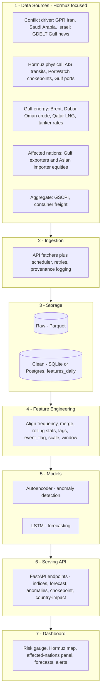
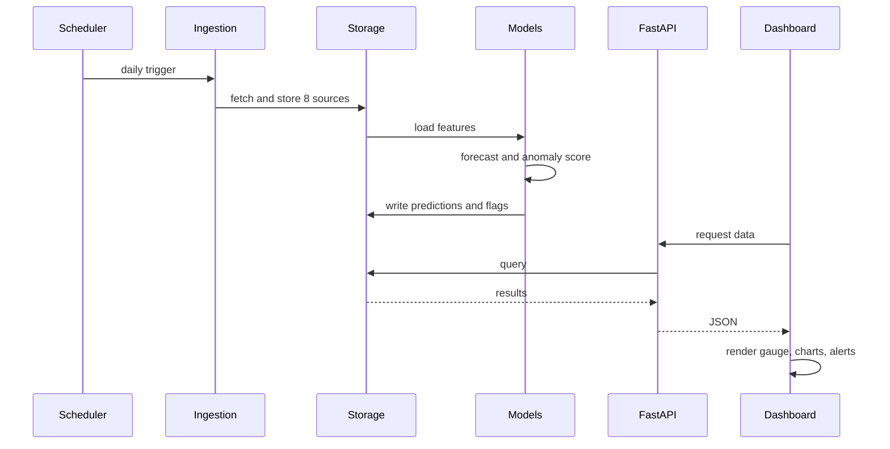
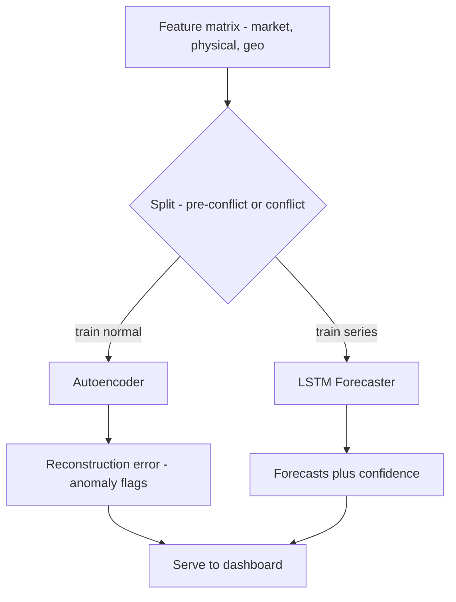

# Project Architecture — Supply Chain Disruption Dashboard (US–Iran Conflict)

A readable, layer-by-layer architecture of the project. Pairs with
[WORKFLOW.md](WORKFLOW.md) (build phases, model specs, data links).

---

## The Core Idea (read this first)

The whole system models one causal story:

> **A US–Iran escalation (geopolitical shock) disrupts shipping through the
> Strait of Hormuz (physical disruption), which pushes up oil and freight prices
> (market pressure), which shows up in the overall supply chain pressure index
> (aggregate effect).**

Every layer below exists to **capture, process, model, or display** some part of
that chain.

---

## Layered Architecture

---

## What each layer does and why

**1 — Data Sources.** Feeds grouped by their role in the causal story
(driver → physical → market → aggregate), and **scoped to the Strait of Hormuz and
directly-affected nations**: Gulf exporters (Saudi Arabia, UAE, Qatar, Kuwait, Iraq,
Oman, Bahrain, Iran) on the supply side and Hormuz-dependent Asian importers (China,
India, Japan, South Korea) on the demand side. Grouping this way keeps the thesis
clear and makes the dashboard narrative easy to explain.

**2 — Ingestion.** Scheduled fetchers pull each source on its own cadence (15-min
for GDELT, daily for prices, monthly for GSCPI). It logs *where each number came
from* (source URL + license) so results stay citable and "foolproof."

**3 — Storage.** Two tiers: **raw Parquet** (never modified — your audit trail)
and a **clean database table** (`features_daily`) that everything downstream reads.
This separation means you can always re-derive features without re-fetching.

**4 — Feature Engineering.** The bridge between messy raw data and model-ready
input: aligns all sources to a common daily frequency, merges them, adds rolling
stats/lags/volatility, marks escalation dates with an `event_flag`, scales, and
cuts sliding windows for the sequence model. **Scalers are fit on training data
only** to avoid leakage.

**5 — Models (the DL core).** Two complementary models:
- **Autoencoder** — trained only on *pre-conflict "normal"* data; flags disruptions
  as high reconstruction error. (Reuses the classroom lab.)
- **LSTM** — forecasts oil/freight/GSCPI and shows how accuracy degrades during
  conflict windows.

**6 — Serving API.** FastAPI exposes stored predictions and series through clean
endpoints (including `/chokepoint` for Hormuz transits and `/country-impact` per
affected nation), decoupling the models from the UI so either can change
independently.

**7 — Dashboard.** Streamlit (or React) renders the risk gauge, forecasts, anomaly
alerts, the **Strait of Hormuz chokepoint map**, the **affected-nations impact
panel**, and the event overlay — the human-facing end of the causal story.

---

## How a request flows through it (runtime)

---

## Model Flow (training + inference)

---

## Two ways to build it (design choice)

| Approach | Structure | Best for |
|---|---|---|
| **Simple (recommended for course)** | Streamlit calls the models directly — skip the separate API (merge layers 6+7) | Fast delivery, fewer moving parts |
| **Full (production-style)** | FastAPI backend + React frontend, fully decoupled | Polish, scalability, resume value |

---

## One-line summary

**Sources → Ingestion → Storage → Features → Models (Autoencoder + LSTM) → API → Dashboard**,
with each layer mapped to a stage in the geopolitical-shock-to-supply-chain-pressure
story.
