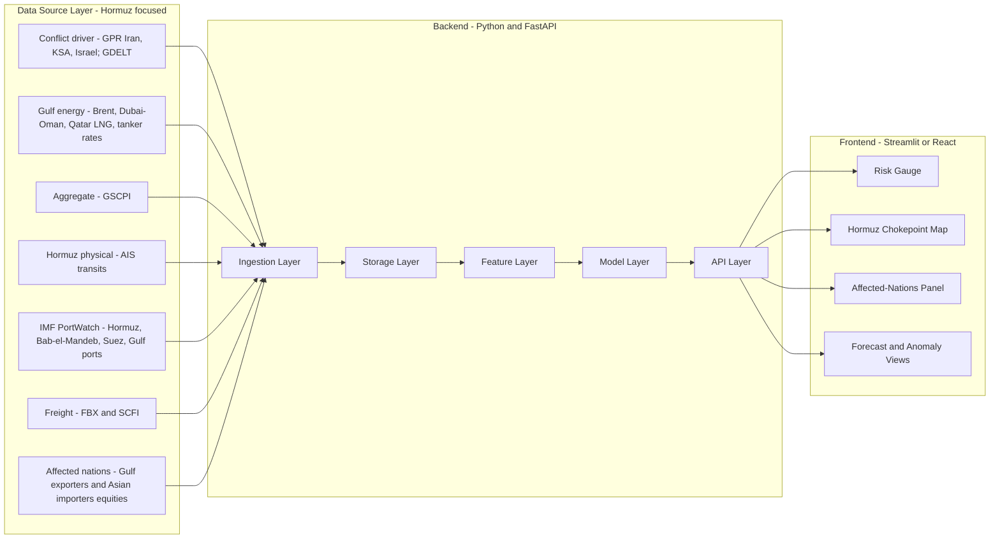
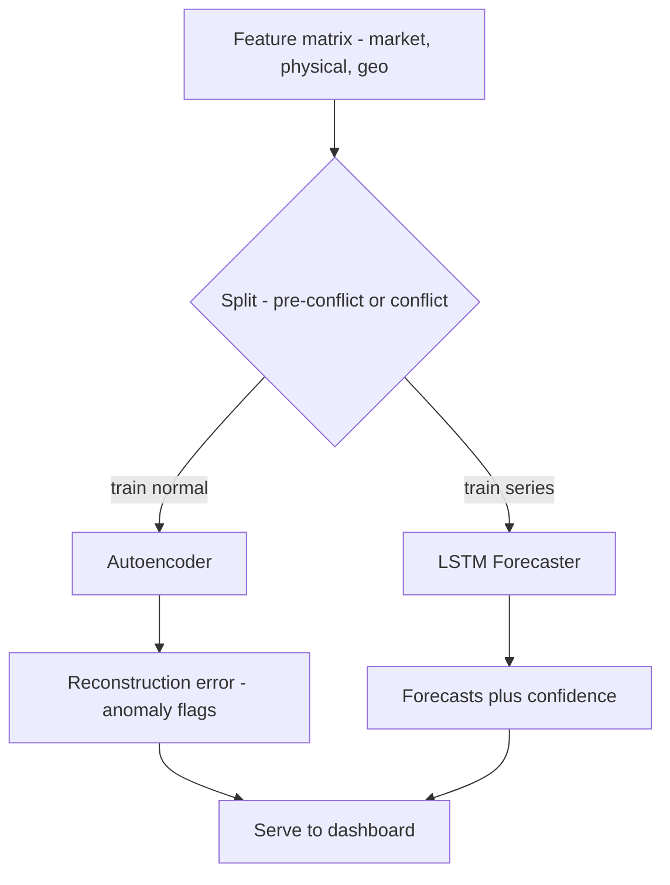
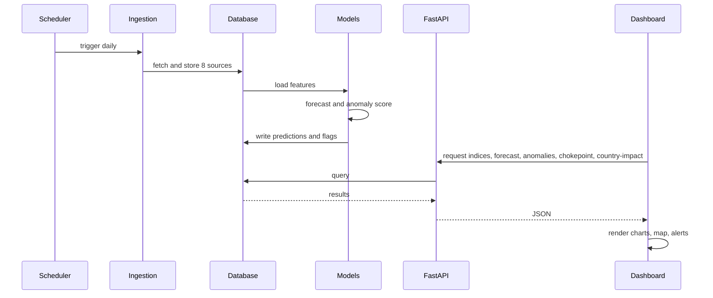

# Supply Chain Disruption Dashboard — US–Iran Conflict

End-to-end workflow for a deep-learning dashboard that detects and forecasts supply
chain disruptions linked to US–Iran conflict escalation.

---

## 1. Project Overview

**Goal:** An interactive dashboard that ingests live + historical supply chain data,
detects and forecasts disruptions linked to US–Iran conflict escalation, and
visualizes the chain: **geopolitical shock → physical shipping disruption →
energy/freight pressure → overall supply chain pressure.**

**Core dashboard outputs:**
- Live disruption "risk gauge" (composite of GSCPI, freight, Hormuz transit)
- Forecasts (oil, freight, GSCPI) for next N periods
- Anomaly alerts (autoencoder reconstruction spikes)
- Event overlay (US–Iran escalation dates vs. index reactions)

---

## 2. High-Level Architecture



---

## 3. Data Layer (8 sources)

| # | Dataset | Role | Source | Freq | Access |
|---|---|---|---|---|---|
| 1 | **GSCPI** | Global aggregate disruption target | NY Fed | Monthly | Free |
| 2 | **Oil benchmarks: Brent + Dubai/Oman** (`DCOILBRENTEU`, Dubai marker) | Energy shock via Hormuz (Gulf crude) | FRED / EIA | Daily | Free key |
| 3 | **LNG: Qatar/Asia JKM marker** | Hormuz LNG dependency (Qatar exports) | EIA / S&P Platts | Daily/Weekly | Freemium |
| 4 | **Tanker rates: Baltic Dirty Tanker Index / VLCC Gulf→Asia** | Hormuz oil-shipping cost pressure | Baltic Exchange | Daily | Freemium |
| 5 | **GPR country indices: Iran, Saudi Arabia, Israel** | Conflict driver variable | Iacoviello | Daily/Monthly | Free CSV |
| 6 | **AIS Vessel Transits — Strait of Hormuz** | Physical chokepoint disruption | MarineTraffic/Spire | Real-time | Paid (use sample) |
| 7 | **IMF PortWatch — Hormuz, Bab-el-Mandeb, Suez + Gulf ports** | Chokepoint transits + port congestion | IMF | Daily | **Free** |
| 8 | **Freight Spot Rates (FBX/SCFI)** | Container pricing pressure (reroute cost) | Freightos/SSE | Daily/Weekly | Freemium |
| 9 | **Affected-nation equity indices / ETFs** | Market impact on exporters + importers | yfinance | Daily | Free |
| 10 | **GDELT tone (Gulf-nations filter)** *(optional)* | News sentiment feature | GDELT | 15-min | Free |

**Directly-affected nations tracked (source #9):**
- **Gulf exporters (supply side, ship via Hormuz):** Saudi Arabia (Tadawul / `KSA`), UAE (`ADX`, `DFM`), Qatar (`QSE`, LNG), Kuwait, Iraq, Bahrain, Oman, plus Iran.
- **Major Asian importers (demand side, Hormuz-dependent crude):** China (`FXI`), India (`INDA`), Japan (`EWJ`), South Korea (`EWY`).
- **Regional/adjacent:** Israel (`EIS`) — conflict proximity.

**Grouping (by role in the causal chain):**
- **Conflict driver:** GPR (Iran / Saudi Arabia / Israel), GDELT (Gulf-filtered news)
- **Strait of Hormuz — physical:** AIS Hormuz transits, IMF PortWatch chokepoints + Gulf ports (Ras Tanura, Jebel Ali, Fujairah, Bandar Abbas, Ras Laffan)
- **Energy shipped via Hormuz:** Brent + Dubai/Oman crude, Qatar LNG (JKM), tanker rates
- **Affected-nation markets:** Gulf exporter + Asian importer equity indices
- **Aggregate pressure:** GSCPI, container freight (FBX/SCFI)

**Storage:** raw pulls → Parquet (immutable); cleaned/merged → SQLite/Postgres
`features_daily`; `sources_metadata` table logs URL + license per source (citeability).

> **Future Work (out of core scope):** NOAA/Copernicus weather feeds,
> Panama Canal/Rhine climate bottlenecks, supplier financial risk (D&B/Bloomberg),
> cybersecurity posture — different hazard vectors, folded into a
> "multi-hazard extension" section.

---

## 4. Feature / Processing Layer

Flow: **fetch → validate → align frequency → merge → engineer → scale → window**

- **Frequency alignment:** resample to daily; forward-fill monthly indices
  (GSCPI, GPR monthly); aggregate intraday AIS/GDELT to daily.
- **Strait-of-Hormuz physical features:**
  - **AIS:** daily Hormuz vessel transits, mean vessel speed, waiting-area vessel count.
  - **PortWatch:** Hormuz/Bab-el-Mandeb/Suez chokepoint transit volume; Gulf port
    dwell times (Ras Tanura, Jebel Ali, Fujairah, Bandar Abbas, Ras Laffan).
- **Energy features:** Brent + Dubai/Oman spread, Qatar LNG (JKM) level/return,
  VLCC Gulf→Asia tanker rate + % change (leading indicator).
- **Affected-nation features:** exporter (KSA/UAE/Qatar) and importer
  (China/India/Japan/S. Korea) equity index returns + volatility.
- **Standard features:** rolling mean/std (7/30-day), returns, volatility, lags,
  `event_flag` (escalation dates), GPR (Iran/KSA/Israel) spikes.
- **Scaling:** `StandardScaler`/`MinMaxScaler` fit on train only (no leakage).
- **Windowing:** sliding windows (e.g., 30 steps → predict 1–7).

---

## 5. Model Layer

### Model A — LSTM Forecaster

```
Input: (batch, 30 timesteps, n_features)
 → LSTM(64, return_sequences=True) → Dropout(0.2)
 → LSTM(32) → Dropout(0.2)
 → Dense(16, ReLU) → Dense(horizon)
Loss: MSE | Optimizer: Adam | Metrics: MAE/RMSE
```

### Model B — Autoencoder Anomaly Detector (reuses the classroom lab)

```
Encoder: Dense(32,ReLU) → Dense(16,ReLU) → Dense(8,ReLU)  [bottleneck]
Decoder: Dense(16,ReLU) → Dense(32,ReLU) → Dense(n_features, linear)
Loss: MSE | Disruption = reconstruction_error > 95th-percentile threshold
```

Train autoencoder on **pre-conflict "normal" data**; conflict disruptions
(including Hormuz AIS/freight anomalies) surface as high reconstruction error.



---

## 6. Backend

**Stack:** Python + **FastAPI**, APScheduler, SQLAlchemy, joblib/`.keras`.

- **Ingestion service:** per-source fetchers (FRED/EIA oil + LNG, GSCPI, GPR
  Iran/KSA/Israel, IMF PortWatch chokepoints, tanker + FBX rates, AIS Hormuz
  sample, affected-nation ETFs, GDELT) with retries + provenance logging.
- **Training pipeline:** offline; versions models + scaler + threshold.
- **Inference service:** daily forecast + anomaly scoring.
- **REST endpoints:**
  - `GET /indices` → merged time series
  - `GET /forecast?target=brent&horizon=7`
  - `GET /anomalies` → flags + scores
  - `GET /chokepoint?name=hormuz` → Hormuz/Bab-el-Mandeb/Suez AIS + PortWatch transits
  - `GET /country-impact?nation=saudi_arabia` → per-nation market + trade impact
  - `GET /energy?type=oil|lng|tanker` → Gulf crude, Qatar LNG, tanker-rate series
  - `GET /events` → escalation dates
  - `GET /risk-summary` → composite gauge

---

## 7. Frontend

**Recommended:** **Streamlit** (fast, pure Python) — or React + Plotly for polish.

**Components:**
1. **Risk Gauge** — composite disruption score.
2. **Time-series panel** — GSCPI, Gulf oil, LNG, freight with escalation markers.
3. **Strait of Hormuz map (NEW)** — chokepoint map centered on Hormuz showing vessel
   transits/speed (AIS + PortWatch), plus Bab-el-Mandeb and Suez alternates.
4. **Affected-nations panel (NEW)** — exporter (KSA, UAE, Qatar) vs. importer
   (China, India, Japan, S. Korea) market-impact heatmap and rankings.
5. **Forecast view** — actual vs. predicted + confidence band + horizon slider.
6. **Anomaly panel** — reconstruction-error chart + alert list.
7. **Event-study view** — GPR/GDELT spikes vs. oil/LNG/freight/transit reactions.
8. **Filters** — date range, nation, chokepoint, dataset, forecast horizon.

---

## 8. End-to-End Runtime Flow



---

## 9. Tech Stack

| Layer | Tools |
|---|---|
| Ingestion | `requests`, `fredapi`, `yfinance`, PortWatch/FBX clients, APScheduler |
| Storage | SQLite/Postgres, Parquet |
| Processing | `pandas`, `numpy`, `scikit-learn` |
| Modeling | TensorFlow/Keras (LSTM, Autoencoder) |
| Backend | FastAPI, SQLAlchemy, joblib |
| Frontend | Streamlit **or** React + Plotly |
| Deployment | Docker; Streamlit Cloud / Render / HF Spaces |

---

## 10. Build Phases

1. **Phase 1 – Data:** loaders for FRED/EIA (Gulf oil + LNG) + GSCPI + GPR
   (Iran/KSA/Israel) + **IMF PortWatch (Hormuz) + FBX + affected-nation ETFs**
   (free wins first), AIS Hormuz sample.
2. **Phase 2 – EDA:** event study around escalation dates + Hormuz transit overlay
   + exporter-vs-importer market reaction.
3. **Phase 3 – Models:** train autoencoder + LSTM on enriched features; save artifacts.
4. **Phase 4 – Backend:** FastAPI endpoints (incl. `/chokepoint`, `/country-impact`).
5. **Phase 5 – Frontend:** Streamlit dashboard + Hormuz map + affected-nations panel.
6. **Phase 6 – Polish:** scheduling, threshold tuning, deploy.

---

## Data Source Links

- **GSCPI (NY Fed):** https://www.newyorkfed.org/research/policy/gscpi
- **FRED:** https://fred.stlouisfed.org/ — API key: https://fredaccount.stlouisfed.org/apikeys
- **GPR Index (Iacoviello, incl. country indices):** https://www.matteoiacoviello.com/gpr.htm
- **IMF PortWatch (Hormuz, Bab-el-Mandeb, Suez chokepoints):** https://portwatch.imf.org/
- **Freightos Baltic Index (FBX):** https://fbx.freightos.com/ — API: https://developers.freightos.com/freight-tools
- **Baltic Exchange (Dirty Tanker Index / VLCC rates):** https://www.balticexchange.com/en/data-services/market-information0/dirty-services.html
- **EIA (Gulf crude + LNG spot prices, Dubai/Oman marker):** https://www.eia.gov/petroleum/ — API: https://www.eia.gov/opendata/
- **MarineTraffic / AIS (Strait of Hormuz):** https://www.marinetraffic.com/
- **GDELT (Gulf-nation news tone):** https://www.gdeltproject.org/
- **World Bank Pink Sheet (commodity prices):** https://www.worldbank.org/en/research/commodity-markets
- **IMF Primary Commodity Prices:** https://www.imf.org/en/Research/commodity-prices
- **UNCTAD Maritime Transport:** https://unctad.org/topic/transport-and-trade-logistics/review-of-maritime-transport
- **Affected-nation equity ETFs (via yfinance):** KSA, `ADX`/`DFM` (UAE), `QSE` (Qatar), `FXI` (China), `INDA` (India), `EWJ` (Japan), `EWY` (S. Korea), `EIS` (Israel)
